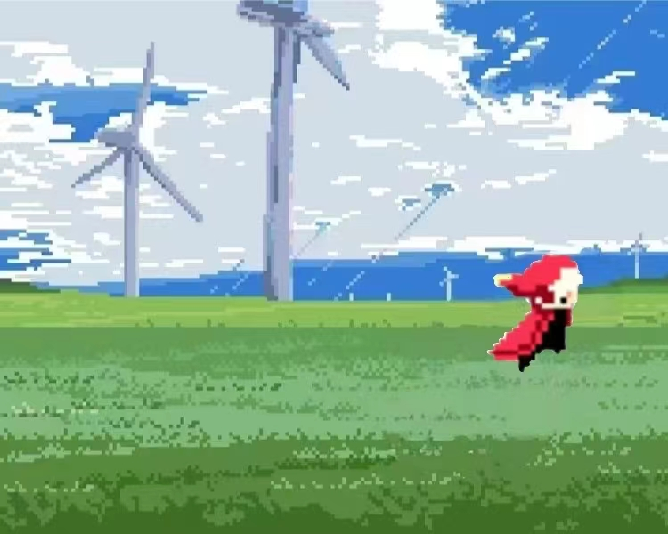

# 万里归途

> 基于 C++ 与 FunCode 引擎开发的 2D 剧情闯关游戏



## 项目简介

《万里归途》是一款使用 C++ 开发、运行于 FunCode / Torque 2D 引擎上的 2D 闯关游戏。玩家将在像素风格场景中探索迷宫、完成解谜与跑酷挑战，并通过答题关卡逐步推进剧情。

## 游戏特色

- 像素风格 2D 场景与角色动画
- 迷宫探索、箱子解谜、跑酷等多种关卡玩法
- 鼠标交互界面与键盘角色控制
- 精灵碰撞、音效和关卡切换逻辑
- 双题问答与结局页面

## 游戏流程

1. **迷宫关**：控制角色在迷宫中移动，到达红旗位置后进入下一关。
2. **箱子关**：在障碍场景中寻找正确路线并推进关卡。
3. **跑酷关**：在限定场景中前进和跳跃，抵达目标旗帜；碰到危险物后需要重新开始。
4. **答题关**：完成两道剧情问答题，答错会返回第一关重新挑战。
5. **结局**：通过答题后进入剧情结局页面并返回主界面。

## 操作说明

### 鼠标

- 主界面中移动鼠标至按钮可查看悬停效果。
- 点击“开始游戏”进入第一关。
- 点击“游戏介绍”或“游戏背景”查看对应页面。
- 使用页面中的“下一页”“上一页”“返回”和“重新开始”按钮进行导航。
- 在答题页面点击选项进行作答。

### 键盘

| 按键 | 作用 |
| --- | --- |
| `W` | 向上移动 / 跳跃 |
| `S` | 向下移动 |
| `A` | 向左移动 |
| `D` | 向右移动 |

不同关卡会根据当前游戏场景启用对应的移动逻辑。

## 运行游戏

项目包含 Windows 预编译版本：

```powershell
cd Bin
.\Game.exe
```

也可以在文件资源管理器中打开 `Bin` 目录并双击 `Game.exe`。

> `Game.exe` 依赖同目录下的引擎 DLL 和 `game` 数据目录，请勿只单独复制可执行文件。

## 源码构建

### 环境要求

- Windows
- FunCode / Torque 2D 开发环境
- Code::Blocks 与 GCC 工具链

`project.funProj` 中记录的工程版本为 Torque 2D `v1.7.5`，最低版本为 `v1.1.4`。

### 使用 FunCode 打开

1. 使用 FunCode / Torque Game Builder 打开根目录下的 `project.funProj`。
2. 在编辑器中查看和修改 `Bin/game/data/levels` 下的 `.t2d` 关卡文件。
3. 使用项目构建功能重新编译源码。

### 使用 Code::Blocks 构建

1. 打开 `SourceCode/CodeBlock/llllllll.cbp`。
2. 选择 `Debug` 或 `Release` 构建目标。
3. 编译并运行项目。
4. 构建输出位置为 `Bin/Game.exe`。

工程通过 `SourceCode/Src/CommonAPI.a` 链接 FunCode API，并依赖 Windows `winmm` 库。

## 项目结构

```text
万里归途/
├─ Bin/
│  ├─ Game.exe                 # 游戏主程序
│  ├─ EngineDllC.dll           # FunCode 引擎运行库
│  ├─ EngineDllCpp.dll         # C++ 引擎接口运行库
│  └─ game/
│     ├─ data/
│     │  ├─ images/            # 图片与像素素材
│     │  ├─ levels/            # .t2d 关卡文件
│     │  └─ audio/             # 音效资源
│     └─ managed/              # 引擎数据块配置
├─ SourceCode/
│  ├─ Header/                  # CommonAPI 与游戏声明
│  ├─ Src/                     # C++ 游戏逻辑源码
│  └─ CodeBlock/               # Code::Blocks 工程文件
└─ project.funProj             # FunCode / Torque 2D 工程入口
```

## 核心代码

- `SourceCode/Src/Main.cpp`：引擎输入、碰撞等回调入口。
- `SourceCode/Src/LessonX.cpp`：游戏状态、关卡切换、角色控制和碰撞逻辑。
- `SourceCode/Header/CommonAPI.h`：FunCode C++ API 声明。
- `Bin/game/managed/datablocks.cs`：图片、动画等资源数据块定义。

## 许可证说明

当前仓库未单独声明项目开源许可证。FunCode / Torque 2D 引擎及项目内第三方素材可能受各自许可证约束；如需重新分发或商业使用，请先查看 `Bin/common/data/help/2.License.hfl` 并确认相关授权。

## 作者

GitHub: [@zengrui2003](https://github.com/zengrui2003)